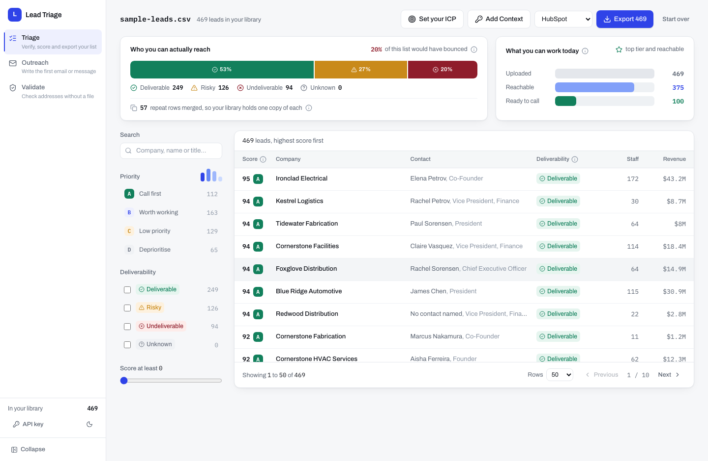
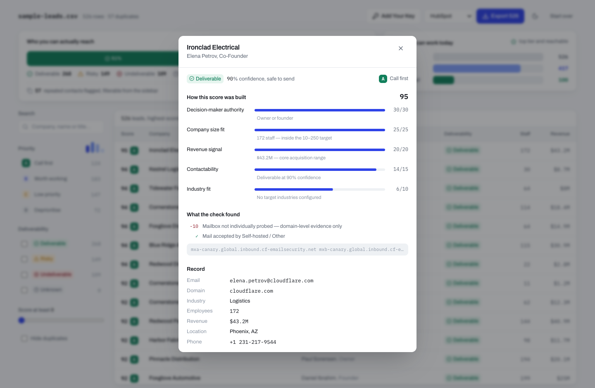
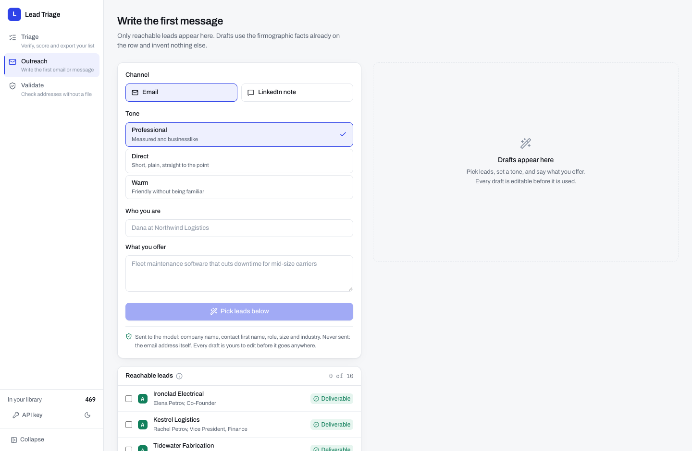
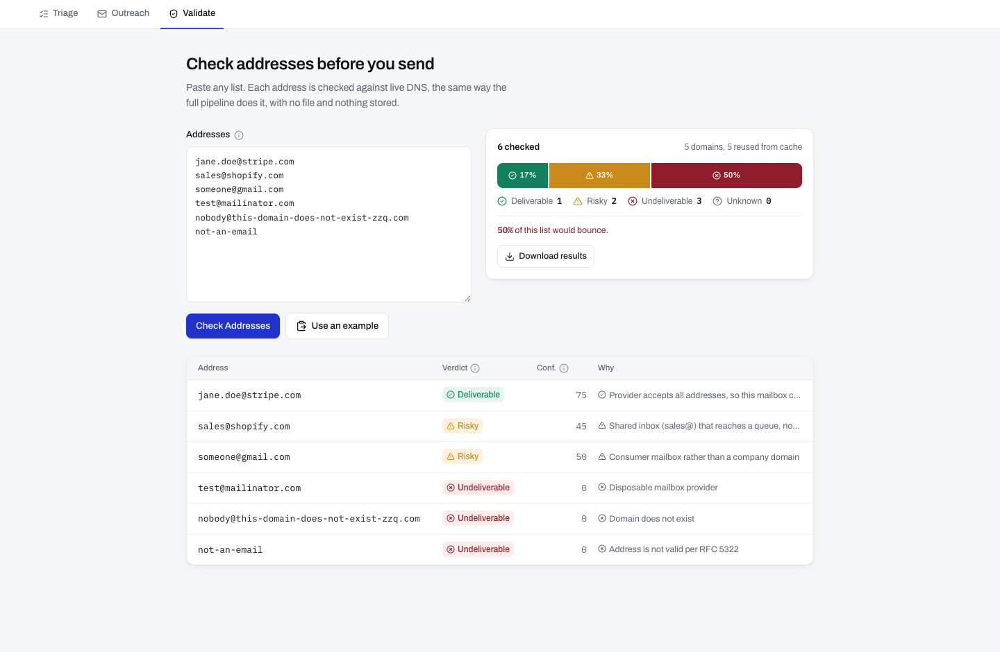

# Lead Triage

**Find out which of your scraped leads can actually be reached, and who to call first.**

Built for the Caprae Capital Full Stack Developer assessment, as an enhancement to
[SaaSquatch Leads](https://www.saasquatchleads.com/).

<!-- Add once deployed: **Live demo:** <url> · **Walkthrough video:** <url> -->



## The problem

SaaSquatch finds leads. This fixes what happens next.

Scraped lists **bounce** — inbox providers penalise senders above roughly a 2% bounce rate, so
one campaign can damage a sending domain for months. And they arrive **flat**, so reps spend the
morning deciding who to call instead of calling.

On the bundled sample, **20% of the list would have bounced**.

## What it does

Upload a CSV. Every address is checked against live DNS, every company is scored against your
ICP and tiered A–D, then you filter and export CRM-ready. Uploads accumulate into a library;
repeats are merged rather than duplicated.

| Section | |
|---|---|
| **Triage** | Verify, score, filter, export |
| **Outreach** | A first email or LinkedIn message, offered only for leads verification cleared |
| **Validate** | Check addresses with no file |

Every asserted number opens the rule behind it — the deduction table, the five weights, the
tier cut-offs. A judgement a rep cannot interrogate is one they will not trust.



| Outreach | Validate |
|---|---|
|  |  |

## Quick start

```bash
docker compose up          # app on http://localhost:3000, Postgres on 5433
```

Or without Docker:

```bash
npm install && npm run dev
```

**No configuration needed.** Click **Load Sample Dataset** to run the whole workflow — its 526
rows land as 469 leads, because the 57 repeats are merged.

| Command | |
|---|---|
| `npm run dev` / `build` / `start` | Development and production |
| `npm run typecheck` | Strict TypeScript |
| `npm run seed` | Regenerate the sample dataset |

### Environment variables

One, and it is optional.

| | |
|---|---|
| `DATABASE_URL` | Postgres connection string. Without it the app uses an in-memory store, so a clean clone runs with no setup. TLS is negotiated automatically |

**No API key ships, and none can be set on the server.** Each person supplies their own for
Gemini or OpenCode Go inside the app; it stays in their browser and is never logged or stored.
No secret has been committed.

## Architecture

One Next.js 16 container serves the UI and the API on a single port.

```
Browser (React 19, Tailwind v4, Motion)
   |  JSON + Server-Sent Events
Next.js route handlers (runtime: nodejs)
   |  upload · process · enrich · outreach · verify · export
lib/  verify (DNS) · score (rules) · ai (providers) · csv · store
   |
Postgres (Neon) — or in-memory when DATABASE_URL is unset
```

### The six disclosures the brief asks for

| | |
|---|---|
| **Data storage** | Postgres 16, Neon in production. Leads keyed on normalised email, deduplicated on email then company plus contact. Derived columns sit alongside the original row, which is never mutated. Schema creation is idempotent |
| **Caching** | Verification cached per **domain**, not per address, with a 48-hour TTL. The sample's 469 leads resolve to 31 domains, removing about 94% of the DNS work. AI judgments cached per domain and ICP for seven days |
| **Performance** | DNS on a bounded pool of 10 with per-lookup timeouts, so one dead domain cannot stall a batch. Results stream over SSE. The table pages, bounding the DOM to at most 100 rows. Postgres indexes `(dataset_id, tier, status, score DESC)` |
| **Hosting** | Vercel serverless functions on the **Node.js runtime**, which matters: verification calls native `dns.resolveMx`, available there but not on the Edge runtime's V8 isolates. Scales to zero, and cold starts are ~200 ms rather than the ~60 s a free always-on container costs a first visitor |
| **Deployment** | Push to `main` builds and deploys. Configuration is entirely environment variables — one, and it is optional. The repo also ships a multi-stage Dockerfile (non-root, health check) used for local development and as the portability path |
| **Cloud** | Vercel for compute, Neon for Postgres, both free and neither needing a payment method. Nothing is provider-specific: there is no Vercel or Neon SDK anywhere in `lib/`, just the `postgres` driver and raw SQL, so moving means changing one connection string |

Measured in Chrome against the container: 274 kB first load, 120 ms first contentful paint,
3–7 ms of synchronous work per keystroke, no long tasks while filtering 469 leads.

## Decisions worth defending

- **No SMTP probe, so nothing is ever above 90% confidence.** Port 25 is blocked on every free
  host and on AWS by default, and Google and Microsoft answer probes accept-all regardless.
- **Catch-all does not mean risky.** Treating it as risky painted ~90% of legitimate B2B leads
  amber and made the column useless. It caps confidence instead.
- **Scoring is deterministic; AI is optional**, explicitly scoped, and never touches the score.
- **The ICP is editable.** Size window and target industries drive 35 of the 100 points.
  Narrowing the profile moves the A tier from 112 leads to 37 — that difference is the product.
- **Amber and red were re-stepped** after measuring them at a deuteranopia ΔE of 4.7. Every
  status also carries an icon and a word, so identity never depends on hue.
- **The export cannot carry a formula.** Cells opening `=`, `+`, `-` or `@` are neutralised,
  because the input is untrusted scraped text and the output is a file a rep opens in Excel.

| | |
|---|---|
| [`docs/HOW-IT-WORKS.md`](docs/HOW-IT-WORKS.md) | Every rule, with the file that owns it |
| [`docs/DECISIONS.md`](docs/DECISIONS.md) | Why the awkward calls were made |

## What this does not do

- **No mailbox-level proof.** Confidence caps at 90.
- **No scraping.** It acts only on a list you already have.
- **No sign-in.** The library lives in one browser.
- **The sample dataset is synthetic.** SaaSquatch is paid and no account was available.
- **Caps.** 12 MB and 5,000 rows per upload; AI enrichment covers the top 100 leads.

## Ethics

No third-party sites are scraped. Outbound DNS is rate-limited and pooled. Lead data reaches a
model only when you ask for it with your own key, and only company-level fields — never email
addresses. Nothing is retained beyond your own library, and no analytics run.

## Stack

Next.js 16 · React 19 · TypeScript (strict) · Tailwind v4 · Motion · Postgres / Neon ·
Papa Parse · Vercel · Docker (local)
